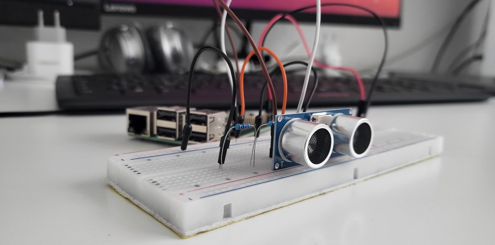
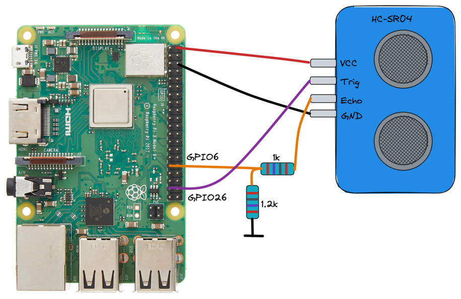

# Linux device driver for HC-SR04 ultrasonic sensor



This repository contains a Linux device driver for the ultrasonic sensor HC-SR04 implemented as a loadable kernel module. The HC-SR04 has a trigger and an echo pin. After triggering a measurement the sensor will set the echo line to high for a specific time. The high-level time is linear to the measured range. The range can be calculated as follows:

```bash
range = high level time * velocity (340M/S) / 2
```

It was tested on Raspberry Pi 3 Model B+, however it should be platform agnostic. Since it was implemented on a Raspberry Pi the following GPIO numbers are used for the triggering and echo pin of the HC-SR04 sensor. If you want to change the used GPIO numbers, simply configure it at the top of the file [hc_sr04.c](hc_sr04.c).

```C
#define GPIO_TRIGGER (26)
#define GPIO_ECHO  (6)
```

## Example wiring with a Raspberry Pi 3 Model B+

The following picture shows an example wiring for the HC-SR04 ultrasonic sensor using a RPI 3 Model B+. The resistors are needed for scaling down the 5V from the Echo pin to 3.3V for the RPI input.



## Reading values from the sensor from a user space app

The linux device driver registers a character device under **/dev/hc-sr04**. A user space application written in Python, C, C++, Go, Bash, etc. can then use the open() and read() syscalls on the **/dev/hc-sr04** character device. When a read() call is issued a measurement is triggered. The range will be returned in millimeters. You need to read 4 bytes (int32) from the device **/dev/hc-sr04**.

The HC-SR04 Linux device driver will take care that only one process can open the character device at a time. If a second process tries to open the file, a -EBUSY will be returned.
The device driver also takes care that there has to be a minimum time of 60 milliseconds to the last triggered measurement. If this is not met by the user app -EBUSY is returned as well.

## Cross-compiling the kernel module

In a typical embedded development environment, software is cross-compiled on a development host machine, e.g. on a Ubuntu PC. Afterwards the cross-compiled binaries and eventually config files are transferred to the embedded device (Raspberry Pi).

### Get Linux kernel headers

In order to cross-compile a Linux kernel module first the right Linux headers must be available which is achieved by cross-compiling the Linux kernel.

For a Raspberry Pi 3 Model B+ these are the steps.

1. Figure out which exact version of the Linux kernel you need to clone. If you compiled the Linux kernel by yourself, you should have it available already. If you e.g. use Raspbian, you need to login to the RPI via ssh and figure out the exact version:

```bash
apt-cache policy raspberrypi-kernel-headers
```

For me the output is:
```bash
raspberrypi-kernel-headers:
  Installed: (none)
  Candidate: 1:**1.20220830**-1
  Version table:
     1:**1.20220830**-1 500
```

2. Clone the Linux kernel. For the RPI the sources are found in the repo https://github.com/raspberrypi/linux. Afterwards checkout the correct version you figured out in step 1:

```bash
git clone https://github.com/raspberrypi/linux.git
cd linux
git checkout 1.20220830
```

3. Now you can cross-compile the Linux kernel in order to obtain the right header files. Dependent on your target architecture (32-bit or 64-bit) the steps might be different. You can follow the instructions on the [Raspberry Pi page](https://www.raspberrypi.com/documentation/computers/linux_kernel.html#cross-compiling-the-kernel).

Example for 32-bit Raspberry Pi 3 Model B+:

```bash
sudo apt install crossbuild-essential-armhf
sudo apt install git bc bison flex libssl-dev make libc6-dev libncurses5-dev

KERNEL=kernel7
make ARCH=arm CROSS_COMPILE=arm-linux-gnueabihf- bcm2709_defconfig
make ARCH=arm CROSS_COMPILE=arm-linux-gnueabihf- zImage modules dtbs
```

### Cross-compile the actual Linux device driver

For cross-compiling the actual linux device driver the provided Makefile is used. The make command needs to have the KERNELDIR specified which is the directory of the cross-compiled Linux kernel.

In this example this is **~/projects/rpi/linux/**.

Inside this repository execute (example for 32-bit):

```bash
make ARCH=arm CROSS_COMPILE=arm-linux-gnueabihf- KERNELDIR=~/projects/rpi/linux/ modules
```

The output shall be **hc_sr04.ko**.

## Load module

For using the module the compiled kernel module **hc_sr04.ko** needs to be copied to the target device, e.g. via scp. Also put the **load_module.sh** script to the device in the same directory. On the device you can load the module:

```bash
sudo ./load_module.sh
```

In case the module was loaded successfully it should appear under the sys logs:

```
sudo dmesg --follow
```